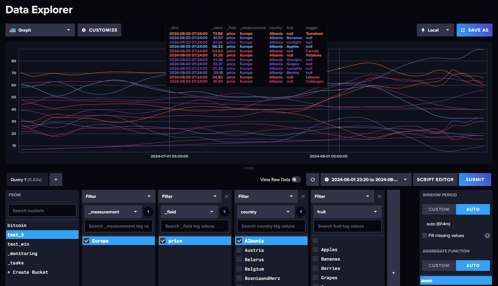

### Домашняя работа 3

#### Первая попытка

- есть два набора данных по ценам на фрукты и овощи<br> 
- в Европейских странах за условные 150 дней<br>
- фрукты - **fruits_dataset.csv**<br>
- овощи  - **veggies_dataset.csv**<br>
- колличество стран и записей в файлах одинаково по 6 фруктов и овощей по 150 дней
- загрузим данные с помощью программы на Python
```python3
import datetime
import influxdb_client 
from influxdb_client.client.write_api import SYNCHRONOUS

# условная начальная дата загрузки данных  01-06-2024 и шаг 1 день
first_date = datetime.datetime(year=2024, month=6, day=1, hour=6)
delta = datetime.timedelta(days=1)

# счетчик записей - отслеживать 150 дней
count = 0

URL = "http://192.168.1.244:8086"
BUCKET = "test_3"
ORG = "sirus"
TOKEN = "ICEmDRlB94HhXZmur02hlxEPTe1QCIOE7_j0V-ivdwAokYGs132qpIpDqKkGQtuTZ4vgwnEP3lJe-8EEfaS6lw=="

client = influxdb_client.InfluxDBClient( url=URL, token=TOKEN, org=ORG )
write_api = client.write_api( SYNCHRONOUS )

# открываем три файла - два исходных и один для журнала
with open('fruits_dataset.csv','r') as file01:
    with open('veggies_dataset.csv','r') as file02:
        with open('result_dataset.line','w') as file03:
            #
            line = file01.readline()
            line = file02.readline()
            while True:
                line = file01.readline()
                # по первому файлу проверяем окончание обработки
                if not line:
                    break
                # преобразуем строки в кортежи
                block1 = tuple(line.strip().replace('"','').split(','))
                line = file02.readline()
                block2 = tuple(line.strip().replace('"','').split(','))
                # каждые 150 строк у нас меняется фрукт/овощ или страна
                if (count % 150) == 0:
                    next_date = first_date
                count = count + 1    
                dcount = count // 150
                # преобразуем дату в timestamp InfluxDB
                xtime = int(next_date.timestamp()*1000000000)
                next_date = next_date + delta

                # попытка сделать линейный файл
                #pline1 = 'test' + ',country=' + block1[0] + ',fruit=' + block1[1] + ' price=' + block1[3] + ' ' + str(xtime)    
                #file03.write(pline1+"\n")
                #pline2 = 'test' + ',country=' + block2[0] + ',veggie=' + block2[1] + ' price=' + block2[3] + ' ' + str(xtime)    
                #file03.write(pline2+"\n")

                # загружаем данные в базу и в лог файл
                p1 = influxdb_client.Point('Europe').time(xtime).tag("country",block1[0]).tag("fruit",block1[1]).field("price",float(block1[3]))
                write_api.write( BUCKET, ORG, p1 )
                file03.write( p1.to_line_protocol()+"\n" )
                p2 = influxdb_client.Point('Europe').time(xtime).tag("country",block2[0]).tag("veggie",block2[1]).field("price",float(block2[3]))
                write_api.write( BUCKET, ORG, p2 )
                file03.write( p2.to_line_protocol()+"\n" )
                pass            
```

// В выборке видно что при добавлении одинаковых записей в базу с разными тэгами есть значения NULL другого тэга<br>
// и одновременно нельзя посмотреть какой-то овощ и какой-то фрукт<br>




####  Попытка № 2

- переделаем программ и загрузим данные используя имя фрукта или овоща как ключ поля (key field)
```python
import datetime
import influxdb_client 
from influxdb_client.client.write_api import SYNCHRONOUS

# условная начальная дата загрузки данных  01-06-2024 и шаг 1 день
first_date = datetime.datetime(year=2024, month=6, day=1, hour=6)
delta = datetime.timedelta(days=1)

# счетчик записей - отслеживать 150 дней
count = 0

URL = "http://192.168.1.244:8086"
BUCKET = "test_0301"
ORG = "sirus"
TOKEN = "ICEmDRlB94HhXZmur02hlxEPTe1QCIOE7_j0V-ivdwAokYGs132qpIpDqKkGQtuTZ4vgwnEP3lJe-8EEfaS6lw=="

client = influxdb_client.InfluxDBClient( url=URL, token=TOKEN, org=ORG )
write_api = client.write_api( SYNCHRONOUS )

# открываем три файла - два исходных и один для журнала
with open('fruits_dataset.csv','r') as file01:
    with open('veggies_dataset.csv','r') as file02:
        with open('result_dataset.line','w') as file03:
            #
            line = file01.readline()
            line = file02.readline()
            while True:
                line = file01.readline()
                # по первому файлу проверяем окончание обработки
                if not line:
                    break
                # преобразуем строки в кортежи
                block1 = tuple(line.strip().replace('"','').split(','))
                line = file02.readline()
                block2 = tuple(line.strip().replace('"','').split(','))
                # каждые 150 строк у нас меняется фрукт/овощ или страна
                if (count % 150) == 0:
                    next_date = first_date
                count = count + 1    
                dcount = count // 150
                # преобразуем дату в timestamp InfluxDB
                xtime = int(next_date.timestamp()*1000000000)
                next_date = next_date + delta

                # загружаем данные в базу и в лог файл
                p1 = influxdb_client.Point('Europe').time(xtime).tag("country",block1[0]).field(block1[1],float(block1[3]))
                write_api.write( BUCKET, ORG, p1 )
                file03.write( p1.to_line_protocol()+"\n" )
                p2 = influxdb_client.Point('Europe').time(xtime).tag("country",block2[0]).field(block2[1],float(block2[3]))
                write_api.write( BUCKET, ORG, p2 )
                file03.write( p2.to_line_protocol()+"\n" )
                pass           
```

// получили неплохие данные для запросов и анализа 


####  Пробуем запросы


- Бананы в Австрии за первые 10 дней июня 2024
```
from(bucket: "test_0301")
  |> range(start: 2024-06-01T00:00:00Z, stop: 2024-06-11T00:00:00Z)
  |> filter(fn: (r) => r["_measurement"] == "Europe")
  |> filter(fn: (r) => r._field == "Bananas")
  |> filter(fn: (r) => r.country == "Austria")
```

```
Europe	Bananas	80.8721047827138	2024-06-01T01:00:00.000Z	Austria
Europe	Bananas	80.9922257288276	2024-06-02T01:00:00.000Z	Austria
Europe	Bananas	81.0655538422684	2024-06-03T01:00:00.000Z	Austria
Europe	Bananas	81.1668556633523	2024-06-04T01:00:00.000Z	Austria
Europe	Bananas	81.4115686436161	2024-06-05T01:00:00.000Z	Austria
Europe	Bananas	81.9432129537948	2024-06-06T01:00:00.000Z	Austria
Europe	Bananas	82.8551333471188	2024-06-07T01:00:00.000Z	Austria
Europe	Bananas	84.0118901876037	2024-06-08T01:00:00.000Z	Austria
Europe	Bananas	85.2513319847748	2024-06-09T01:00:00.000Z	Austria
Europe	Bananas	86.5332442194138	2024-06-10T01:00:00.000Z	Austria
```

- среднее значение цены бананов в Австрии "за июнь 2024"
```
from(bucket: "test_0301")
  |> range(start: 2024-06-01T00:00:00Z, stop: 2024-07-01T00:00:00Z)
  |> filter(fn: (r) => r["_measurement"] == "Europe")
  |> filter(fn: (r) => r._field == "Bananas")
  |> filter(fn: (r) => r.country == "Austria")
  |> mean()
```  

```
Europe	Bananas	88.88772326350714	Austria
```

- среднее значение цены бананов в странах "за июнь 2024"
```
from(bucket: "test_0301")
  |> range(start: 2024-06-01T00:00:00Z, stop: 2024-07-01T00:00:00Z)
  |> filter(fn: (r) => r["_measurement"] == "Europe")
  |> filter(fn: (r) => r._field == "Bananas")
  |> group(columns: ["country"])
  |> mean()
```

```
0   59.41234940092654   Albania
1   88.88772326350714   Austria
2   58.437930383031535  Belarus
3   83.24984133967918   Belgium
4   78.69413234018681   BosniaandHerz
5   62.41468499680191   Bulgaria
6   87.65705706210116   Croatia
7   57.304576475006584  CzechRep
8   86.74508280191749   Denmark
9   58.163091352348836  Estonia
10  54.19151647852789   Finland
11  52.06044349928511   France
12  68.87321301787368   Germany
13  65.4099053037912    Greece
14  83.96840795588653   Hungary
15  68.69839985288614   Iceland
16  55.80137996961238   Ireland
```

- средняя цена продуктов в Греции "в июне 2024"
```
from(bucket: "test_0301")
	|> range(start: 2024-06-01T00:00:00Z, stop: 2024-07-01T00:00:00Z)
  |> filter(fn: (r) => r["_measurement"] == "Europe")
  |> filter(fn: (r) => r.country == "Greece")
  |> group(columns: ["_field"])
  |> mean()
```

```
0	Apples	    56.02696944353729
1	Bananas	    65.4099053037912
2	Berries	    12.797990599123322
3	Cabbages    25.57445041110012
4	Carrots	    63.843838513890326
5	Grapes      23.971230359041922
6	Letuces	    19.620366110618686
7	Oranges	    63.664883786522154
8	Potatoes    68.09793542592715
9	Tomatoes    65.26830253730715
10	humidity    32.08906888944713
11	sunlight    61.55319956923586
```

- сложный запрос теперь "за июль 2024 года"<br>
- медиана (не среднее) некоторых продуктов в некоторых странах
```
from(bucket: "test_0301")
  |> range(start: 2024-07-01T00:00:00Z, stop: 2024-08-01T00:00:00Z)
  |> filter(fn: (r) => r["_measurement"] == "Europe")
  |> filter(fn: (r) => r["country"] == "Belgium" or r["country"] == "Denmark" or r["country"] == "Greece")  
  |> filter(fn: (r) => r["_field"] == "Cabbages" or r["_field"] == "Carrots" or r["_field"] == "Potatoes")  
  |> group(columns: ["country","_field"] )
  |> median()
```

```
0	Cabbages    33.216874648993     Belgium
1	Cabbages    25.857352252577     Denmark
2	Cabbages    24.835896009323     Greece
3	Carrots	    50.203537842791     Belgium
4	Carrots	    42.986274284878	    Denmark
5	Carrots	    66.307965586532	    Greece
6	Potatoes    52.995599320453     Belgium
7	Potatoes    44.145374887084     Denmark
8	Potatoes    63.042765925011     Greece
```

- тоже только минимальная цена, выводит и день когда была
```
from(bucket: "test_0301")
  |> range(start: 2024-07-01T00:00:00Z, stop: 2024-08-01T00:00:00Z)
  |> filter(fn: (r) => r["_measurement"] == "Europe")
  |> filter(fn: (r) => r["country"] == "Belgium" or r["country"] == "Denmark" or r["country"] == "Greece")  
  |> filter(fn: (r) => r["_field"] == "Cabbages" or r["_field"] == "Carrots" or r["_field"] == "Potatoes")  
  |> group(columns: ["country","_field"] )
  |> min()
```  

```
0	Europe	Cabbages    27.0238252422031	2024-07-31T01:00:00.000Z    Belgium
1	Europe	Carrots	    31.5821026643587	2024-07-01T01:00:00.000Z    Belgium
2	Europe	Potatoes    32.0854782486695	2024-07-01T01:00:00.000Z    Belgium
3	Europe	Cabbages    17.7886406390932	2024-07-08T01:00:00.000Z    Denmark
4	Europe	Carrots	    35.6959979886641	2024-07-29T01:00:00.000Z    Denmark
5	Europe	Potatoes    36.9289295396171	2024-07-21T01:00:00.000Z    Denmark
6	Europe	Cabbages    23.5638476476477	2024-07-13T01:00:00.000Z    Greece
7	Europe	Carrots	    55.1118614656788	2024-07-05T01:00:00.000Z    Greece
8	Europe	Potatoes    55.6819793654006	2024-07-09T01:00:00.000Z    Greece
```

- использование оконной агрегации - среднее за каждую неделю<br>
- есть маленькая корректировка на понедельник (по умолчанию - начало недели - четверг)
```
from(bucket: "test_0301")
  |> range(start: 2024-06-03T00:00:00Z, stop: 2024-07-29T00:00:00Z)
  |> filter(fn: (r) => r["_measurement"] == "Europe")
  |> filter(fn: (r) => r["country"] == "Belgium")  
  |> filter(fn: (r) => r["_field"] == "Cabbages")  
  |> aggregateWindow(every: 1w, offset: -3d, fn: mean)
```  

```
Europe	Cabbages	40.046500395015094	2024-06-10T00:00:00.000Z	Belgium
Europe	Cabbages	44.23370604688663	2024-06-17T00:00:00.000Z	Belgium
Europe	Cabbages	42.83196781816428	2024-06-24T00:00:00.000Z	Belgium
Europe	Cabbages	36.09581945495187	2024-07-01T00:00:00.000Z	Belgium
Europe	Cabbages	33.07759207606255	2024-07-08T00:00:00.000Z	Belgium
Europe	Cabbages	37.8995052634044	2024-07-15T00:00:00.000Z	Belgium
Europe	Cabbages	37.151188312565125	2024-07-22T00:00:00.000Z	Belgium
Europe	Cabbages	29.61898520136605	2024-07-29T00:00:00.000Z	Belgium
```

- плавающее среднее каждую неделю за 3 прошедших недели
```
from(bucket: "test_0301")
  |> range(start: 2024-06-01T00:00:00Z, stop: 2024-08-01T00:00:00Z)
  |> filter(fn: (r) => r["_measurement"] == "Europe")
  |> filter(fn: (r) => r["country"] == "Belgium")  
  |> filter(fn: (r) => r["_field"] == "Cabbages")  
  |> timedMovingAverage(every: 1w, period: 3w)
```

```
Europe	Cabbages	38.369264293275755	2024-06-06T00:00:00.000Z	Belgium
Europe	Cabbages	40.472388150774435	2024-06-13T00:00:00.000Z	Belgium
Europe	Cabbages	42.04313469211353	2024-06-20T00:00:00.000Z	Belgium
Europe	Cabbages	42.22610745656265	2024-06-27T00:00:00.000Z	Belgium
Europe	Cabbages	39.56204488470559	2024-07-04T00:00:00.000Z	Belgium
Europe	Cabbages	36.07315537015906	2024-07-11T00:00:00.000Z	Belgium
Europe	Cabbages	35.997481253115026	2024-07-18T00:00:00.000Z	Belgium
Europe	Cabbages	35.70519814832332	2024-07-25T00:00:00.000Z	Belgium
Europe	Cabbages	33.72176203772595	2024-08-01T00:00:00.000Z	Belgium
Europe	Cabbages	30.712224310438028	2024-08-01T00:00:00.000Z	Belgium
Europe	Cabbages	28.31886617326317	2024-08-01T00:00:00.000Z	Belgium
```